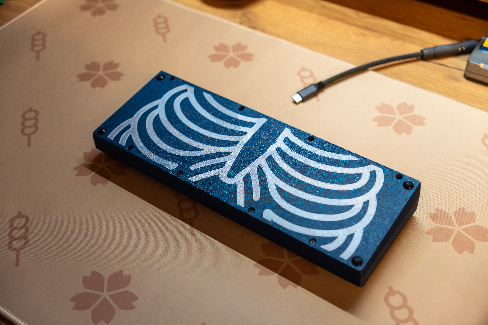
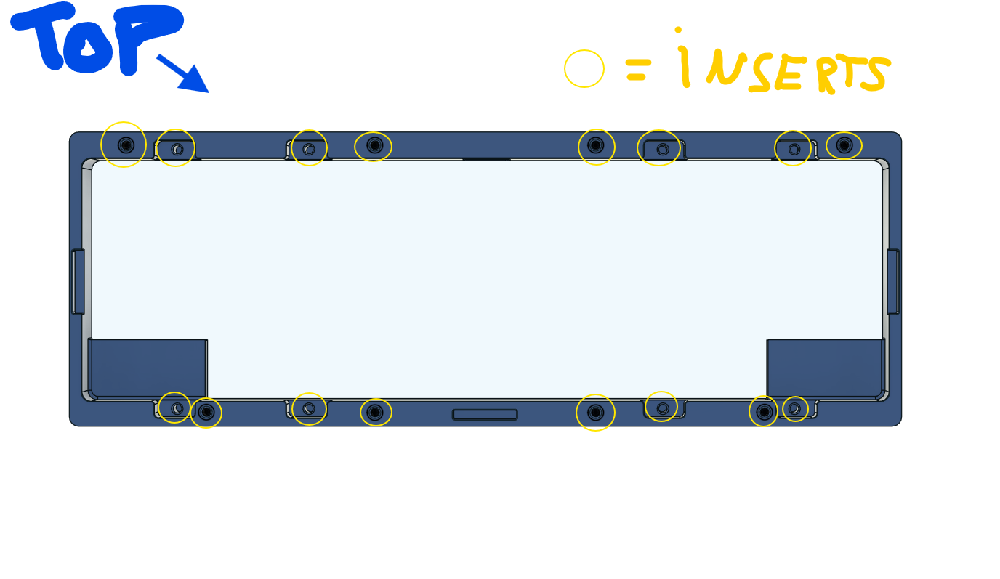
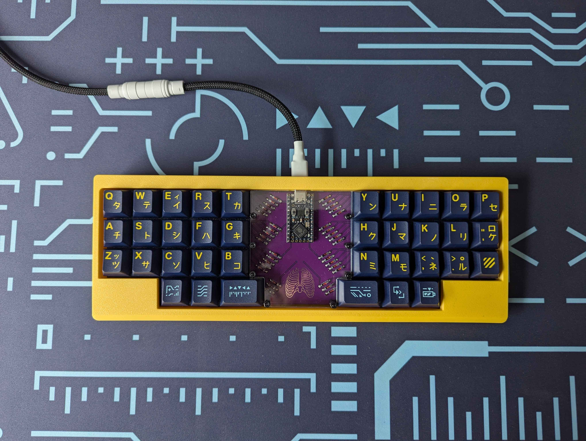

# 36ribs

Here you will find everything you need to make your own 36ribs keyboard. It's my first project, so it's not too complicated.

With that layout you will need 36x keycaps(34x 1u keycaps and for spacebars 2x 1.5u keycaps) and 36x switches.

BOM for pcb
1. 1x pro micro rp2040 controller
2. 36x 1n4148 or 1n4148w diodes, for better looks take through hole diodes
3. 1x B3U-1000P button for reset
4. Optional. 36x hotswap sockets, pcb have both, solder and hotswap

BOM for case
1. 16x m2 4x3.2 inserts
2. 16x m2 5mm screws

BOM for acrylic cover
1. acrylic cover, I've made 3mm for my build
2. 8x m2 10mm standoffs
3. 16x m2 5mm screws

The diodes should be oriented as shown below.

Inserts should be embedded in the marked places.

36ribs wildlife:

