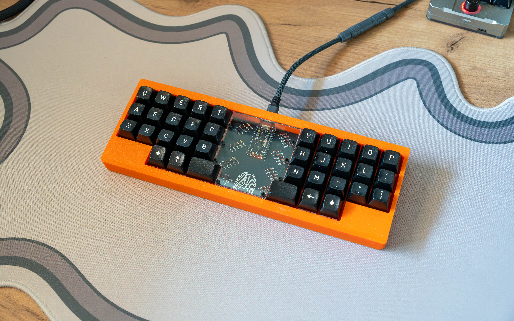
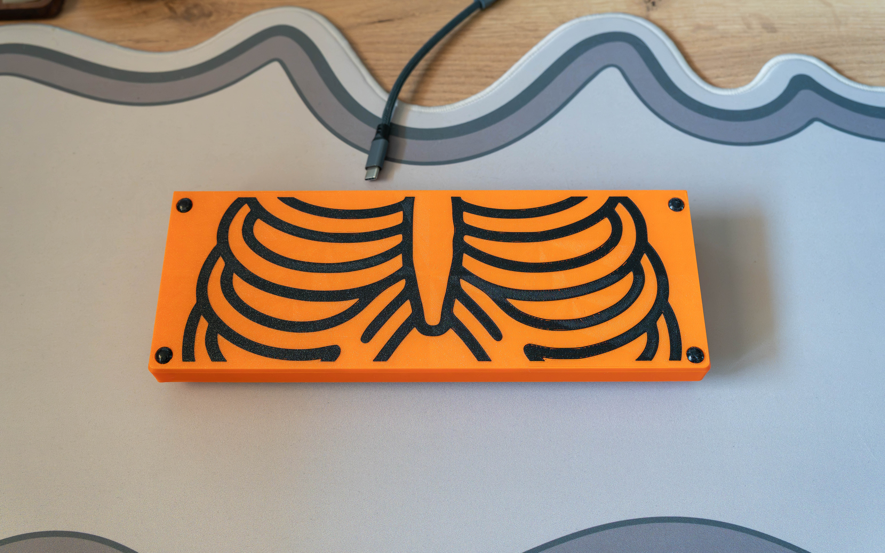
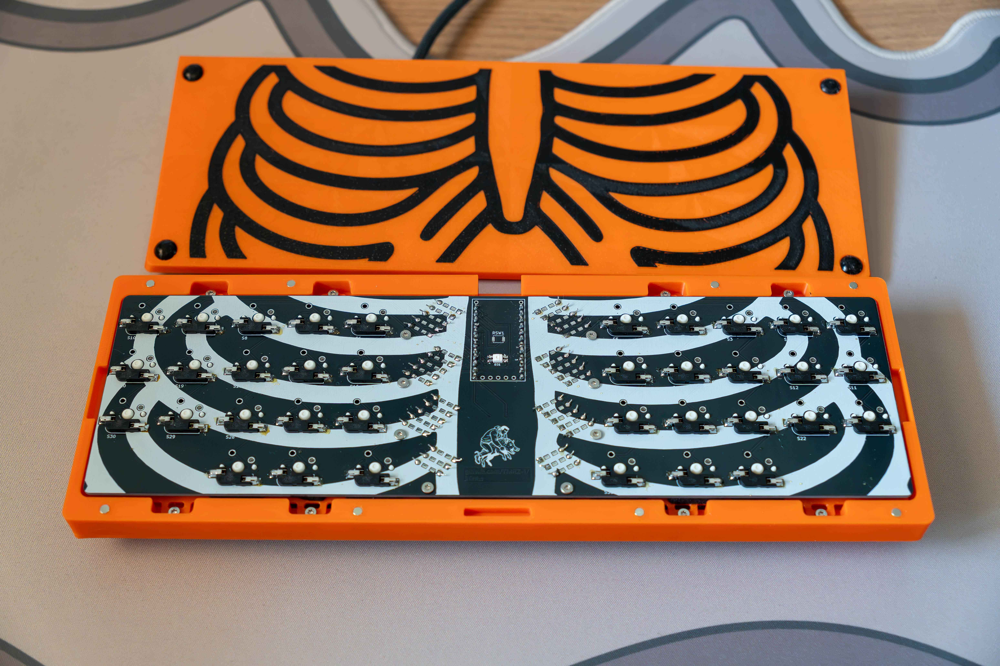
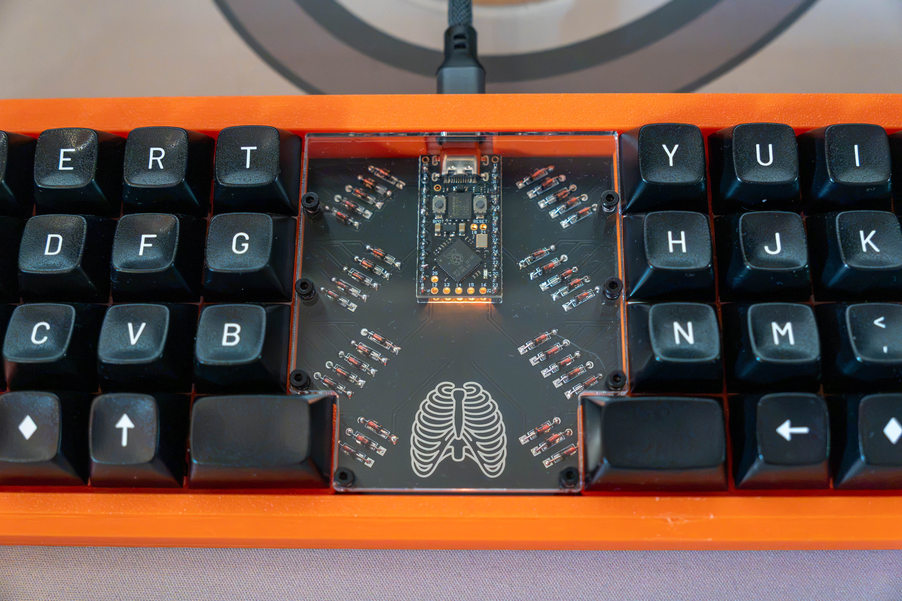
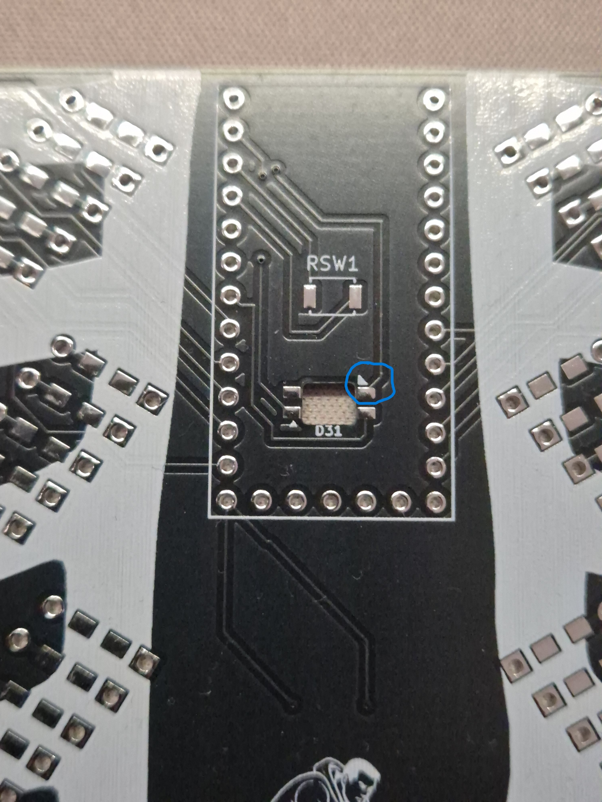

# 36ribs

Here you will find everything you need to make your own 36ribs keyboard. It's my first project, so it's not too complicated. 

# UPDATE
Added one led under controller to light it a bit in the middle and updated vial software. Added two new cases, with magnets, normal one just without screws in case and second one with integrated plate that need only magnets. From these three my fav is one that have top mounted plate and magnets in case.

Case with screws:
  

Case with magnets with updated pcb: 
   

With that layout you will need 36x keycaps(34x 1u keycaps and for spacebars 2x 1.5u keycaps) and 36x switches.

# BOM for pcb
1. 1x pro micro rp2040 controller
2. 36x 1n4148 or 1n4148w diodes, for better looks take through hole diodes
3. 1x B3U-1000P button for reset
4. 1x SK6812 MINI-E RGB
5. Optional. 36x hotswap sockets, pcb have both, solder and hotswap

# BOM for acrylic cover
1. acrylic cover, I've made 3mm for my build
2. 8x m2 10mm standoffs
3. 16x m2 5mm screws

# BOM for v1 case with screws
1. 16x m2 4x3.2 inserts
2. 16x m2 5mm screws

# BOM for case with magnets
1. 8x m2 4x3.2 inserts
2. 8x m2 5mm screws
3. 16x 3x3 cylinder magnets (I used n42)

# BOM for case with magnets and integrated plate
1. 16x 3x3 cylinder magnets (I used n42)

Diodes should be oriented as shown below.

The notched leg of the SK6812 MINI-E RGB LED should be in the marked location

Inserts for v1 case with screws should be embedded in the marked places.

Inserts for magnets case should be embedded in the marked places.

# 36ribs wildlife:

